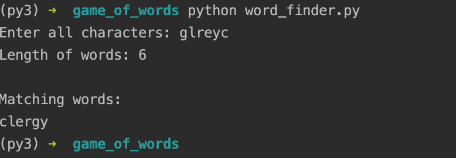

# What it does?
Provide characters and length of word. It will give list of valid english word of given length containing only provided characters. 

# How to use?
- Just run `python word_finder.py`
- Enter all characters (same char multiple time if needed)
- Example screenshot

# Viber Bot
[Link To Viber Bot](viber://pa/info?uri=gameofwords
) -
Scan to Open Viber Bot

Viber usage send `find <characters> <length>`. Example `find glreyc 6`

## Inspiration
We (me and friends) play word games like 4-pic-1-word, word collect, etc. When we get stuck on a level we share and ask if anyone knows the answer. This one is just to not over spent time on thinking.

### Disclaimer
I don't own the word list used in this project, neither had I collected it by myself.

Word List is collected from another github repo [dwyl](https://github.com/dwyl/english-words/).

Credit for word list also goes to [infochimps in webarchive](https://web.archive.org/web/20131118073324/http://www.infochimps.com/datasets/word-list-350000-simple-english-words-excel-readable)
 